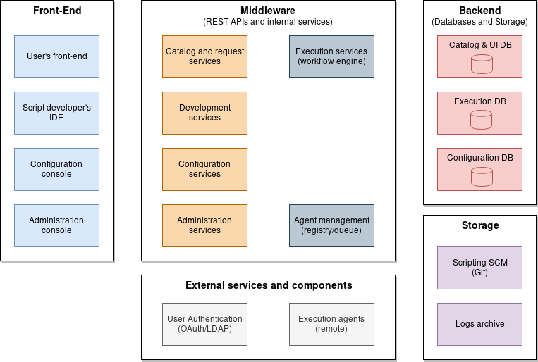

# Shiny-Runs

A Node.js automation self-service solution (*Proof-of-Concept*).

This project contains the ideas and design for a discarded solution for
IT automation (mostly, remote scripting execution).

## Introduction

As part of a DevOps team for years, I've saw in many scenarios a frequent need
for some kind of automation self-service, mostly for running some privileged IT
operation or script on a remote server.

The background is that experienced technical engineers build scripts for many
tasks that can be delegated to operators or directly to users while keeping
execution authorization and auditory. This frees engineers from running the
operations and reporting the results.

A good approach must be able to offer "*level 3*" automation solution
with features like:

- **Configuration management** for infrastructure and services (i.e.
hostnames/ports, credentials, paths, default values, etc.)
- A user **self-service front-end** where they can:
  - See the offered catalog (customized for the user's role)
  - Follow the request's status and see the results and logs
- A developer **front-end** or **IDE** where they can:
  - Develop and test new scripts
  - Configure the script execution work-flow (chain of scripts)
  - Set up the catalog, offering the executions to the users/groups roles
- An **administrative console** for user/group/role management.
- A **work-flow** engine for chaining executions and controlling exceptions
and errors.
- Some kind of scalable **remote agents** for the scripting execution.

## Wait... another "DevOps tool"?

Well... yes, a sort of.

Let's explain a bit more about what's the gap we want to cover with
this tool.

I an [quick and dirty essay](https://bluespot.info/posts/2019/automation-maturity-levels-revised/)
I described tree levels of automation maturity stages that I've frequently
seen in a IT organization (department, team or company).

In a nutshell:

- At the first level, all automation solutions (mostly scripts) are focused
on helping or supporting technical staff work.

- At the second level, technical specialists develop automation solutions to
be operated by... operators, freeing them from the standard work load so
they can build more services, tune the systems/applications or any other
action with higher value.

- The third level is a cloud or self-service mode: the customer can make
requests directly from a user interface or console. Operators just monitor
the system or provide support to the customers.

This project sits for this last level: a user centered console for requesting
IT services. Each request launches a predefined work-flow that can query and
store configuration items, run command-line instructions (scripts or other
tooling calls like executing Ansible playbooks) or call remote services.

## First approach

A tentative overall design picture would roughly be like that:

The front-end user interface must support users with different
roles or profiles for the four main modules (execution, development,
configuration and general management). It could be a *Rich Internet
Application* or a desktop/mobile application.

The central block comprises all the UI services (mostly for CRUD operations),
the back-end access and two execution components: one providing the workflow
engine and another one for the remote agent communication.

The remote agents are instances of a scalable component that pulls from an
execution pool and returns the resulting logs and status.

We will also need some log storage and a source code repository for the
scripts.

P.S. The project name ('shiny-runs') was proposed by the GitHub's random
project generator; it's not planned.
